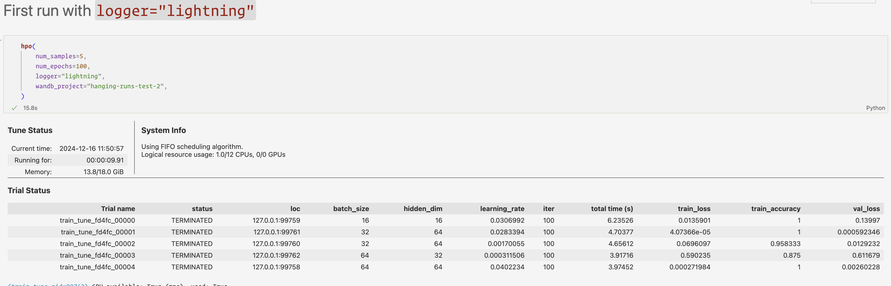
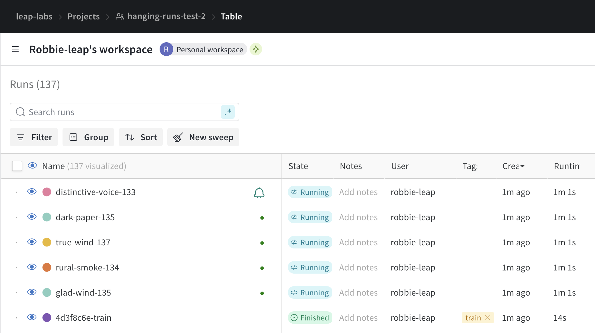
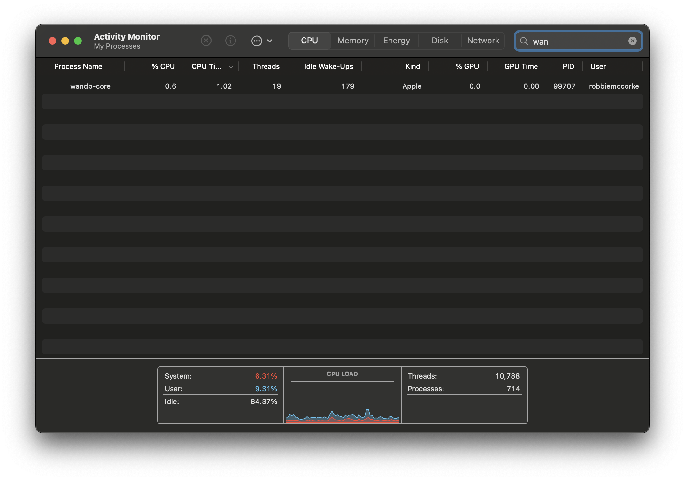

## Description

This project demonstrates a potential issue with Weights and Biases logging under a very specific set of cicrumstances that can result in runs in the Weights and Biases console being stuck in a `Running` state and accumulating a large number of billing Logged Hours.

To reproduce the issue, the specific set of circumstances are:

- The `wandb` sdk used inside python subprocesses (in this case demonstrated by running parallel Hyperparameter Optimisation via Ray Tune)
  - To run `wandb` inside a subprocess, the Pytorch Lightning wandb logger is used.
- The HPO run must be surrounded by a separate `wandb.init()` and `wandb.finish()`. In this case demonstrated by a log that records the duration of the HPO run and the resulting best model metrics.
- The script must be triggered from within a Jupyter notebook environment.

These circumstances can result in the `wandb-core` process to hang and not terminate, which will perpetually send a heartbeat signal for each logged HPO trail, causing them to remain in a `Running` state in the Weights and Biases console.





## Installation

This project uses [uv](https://docs.astral.sh/uv/) for managing dependencies. To install the dependencies, run:

```bash
uv sync
```

This will create a virtual environment in the `.venv` directory and install the dependencies listed in the `pyproject.toml` file.

## Running

### Jupyter notebook

See `test.ipynb` for an example of running the `hpo.py` script in a notebook envioronment.

### Command line

To run the script from the command line, run:

```bash
python hpo.py
```

Arguments can be provided to change the default settings. E.g:

```bash
python hpo.py --logger='ray' --num_samples=10 --num_epochs=10
```

## Results

This demonstration repo provides multiple options to show the described issue occuring and not occuring. The two options that must be present to see the issue occur are:

- The `logger='lightning'` argument must be used to trigger `wandb` logging inside the subprocesses.
- The example must be run from a Jupyter notebook environment.

### Juptyer notebook

#### `logger='lightning'` argument

To see the issue occur, run the `test.ipynb` notebook. This will trigger the `hpo.py` script with the `logger='lightning'` argument.

**Observations:**

- The HPO runs will complete successfully.
- The `wandb` console will show the HPO runs as `Running` indefinitely.
- The `wandb-core` system process will remain running indefinitely.

#### `logger='ray'` argument

When running using the Ray Tune logger inside a Jupyter notebook, the issue does not occur. The runs will complete successfully.

**Observations:**

- The HPO runs will complete successfully.
- The `wandb` console will show the HPO runs as `Finished` at the correct time.
- The `wandb-core` system process still remain running indefinitely.

### Command line

When run via the command line, neither issue occurs. The runs will complete successfully and processes do not get stuck.

#### `--logger='lightning'` argument

**Observations:**

- The HPO runs will complete successfully.
- The `wandb` console will show the HPO runs as `Finished` at the correct time.
- The `wandb-core` system process will terminate correctly.

#### `--logger='ray'` argument

**Observations:**

- The HPO runs will complete successfully.
- The `wandb` console will show the HPO runs as `Finished` at the correct time.
- The `wandb-core` system process will terminate correctly.
